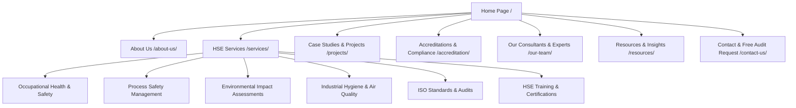
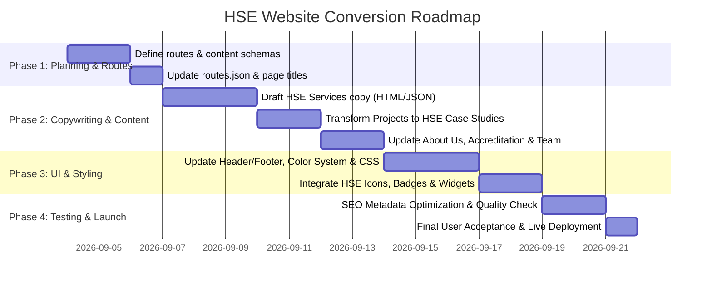

# Transformation Strategy: Converting Website into Kaizen HSE Advisory Portal

## 1. Executive Summary & Brand Positioning

Transforming the website into a **premier Health, Safety, and Environment (HSE) Consultancy portal** under the **Kaizen** brand requires shifting the focus from traditional construction to **risk advisory, regulatory compliance, industrial hygiene, process safety, and environmental sustainability**.

### Brand Value Proposition
* **Brand Name**: Kaizen HSE & Risk Advisory (or Kaizen Safety Advisory)
* **Tagline**: *"Empowering Safe, Compliant, and Sustainable Industrial Operations."*
* **Core Philosophy**: Zero Harm (Zero LTI), Environmental Stewardship, & Uncompromising Quality Compliance.

---

## 2. Information Architecture & Navigation Structure

---

## 3. Core Service Transformation Matrix

Mapping existing website service slots to comprehensive HSE advisory offerings:

| Existing GASCO Service Slot | Proposed HSE Consulting Service | Description & Deliverables |
| :--- | :--- | :--- |
| **Engineering Consultancy** | **Process Safety & Risk Assessment (PSM)** | HAZOP, HAZID, QRA (Quantitative Risk Assessment), LOPA studies, Safety Case development for high-hazard facilities. |
| **Integrated EPC Services** | **ISO Management Systems & Certification Advisory** | ISO 45001 (OH&S), ISO 14001 (EMS), and ISO 9001 integration, gap analysis, internal auditing, and certification guidance. |
| **Pipeline Construction** | **Occupational Health & Site Safety Audits** | On-site safety inspections, behavioral safety observation programs, permit-to-work (PTW) audits, LOTO, and site hazard mapping. |
| **Operations & Maintenance** | **Environmental Consulting & EIA Services** | Environmental Impact Assessments (EIA), carbon footprint analysis, effluent/air monitoring, and waste management strategies. |
| **Rental Compression & Production**| **Industrial Hygiene & Ergonomic Services** | Air toxicity testing, indoor air quality (IAQ), noise mapping, hazardous substance evaluation (COSHH), ergonomic assessments. |
| **Outsource Warehousing** | **HSE Training & Capability Building** | Accredited training modules (OSHA, NEBOSH prep, IOSH, First Aid, Fire Safety, Scaffolding, Confined Space Entry, Working at Heights). |

---

## 4. Key Page Content & Design Strategy

### 4.1 Home Page (`/`)
* **Hero Banner**: High-impact banner with high-vis safety inspectors in a modern plant, video background or slider.
  * Headline: *"Targeting Zero Harm: World-Class HSE & Risk Advisory Services"*
  * CTA Buttons: `[ Request a Safety Audit ]` and `[ Explore HSE Services ]`
* **Key Statistics Counter**:
  * `500+` Comprehensive Safety Audits Completed
  * `100%` ISO Audit Success Rate
  * `15+` Years of Industrial Risk Advisory
  * `50,000+` Personnel Trained & Certified
* **Interactive HSE Audit Checklist / Risk Calculator**: Embed a mini lead-generation widget where users select their industry (Oil & Gas, Construction, Manufacturing, Power) and request a tailored HSE compliance checklist.
* **Core Pillars**: Safety Audits, Environmental Compliance, Training, Process Safety.
* **Client Badges & Certifications**: Grid displaying ISO 45001, ISO 14001, NEBOSH, OSHA, EPA seals.

### 4.2 Services Page (`/services/`)
* **Categorized Layout**:
  * **Category A: Safety Management**: ISO 45001, Behavioral Safety, Site Inspections.
  * **Category B: Technical Safety & Engineering**: HAZOP, SIL, QRA, Fire Safety Design.
  * **Category C: Environmental & Sustainability**: EIA, ESG Compliance, Emissions Monitoring.
  * **Category D: Workforce Health & Training**: Industrial Hygiene, Health Risk Assessments (HRA), Safety Certifications.

### 4.3 Case Studies / Projects (`/projects/`)
Refactor project portfolio entries into **HSE Solutions Delivered**:
1. *ISO 45001 Implementation for Gas Processing Facility*
2. *Environmental Impact Assessment (EIA) for High-Pressure RLNG Pipeline*
3. *HAZOP & QRA Study for Offshore Wellhead Platform*
4. *Industrial Hygiene & Chemical Exposure Audit for Chemical Manufacturing Plant*

### 4.4 Accreditations & Certifications (`/accreditation/`)
* Feature regulatory body approvals (e.g., OSHA, NEBOSH, IOSH, EPA, Local Environmental Protection Agencies, ISO Certification Bodies).
* Downloadable compliance certificates and auditor licenses.

### 4.5 Our Team (`/our-team/`)
* Highlight key consultants with credentials:
  * **Lead Consultant**: Certified Safety Professional (CSP), IRCA Lead Auditor ISO 45001.
  * **Environmental Specialist**: PhD in Environmental Engineering, EIA Registered Practitioner.
  * **Process Safety Lead**: CFSE / TÜV Certified Functional Safety Expert.

### 4.6 Lead Magnets & Resources (New Addition)
* **Downloadable Whitepapers**: "Building a Zero-Incident Culture in Oil & Gas", "ISO 45001 Readiness Kit".
* **Free Checklists**: Site Safety Inspection Template, Emergency Response Plan Checklist.

---

## 5. Visual Aesthetics & UI/UX Enhancements

* **Color Palette Adjustments**:
  * **Dominant/Primary**: Deep Industrial Navy (`#0b1e36`) – builds corporate trust & authority.
  * **Secondary / Eco Accent**: Forest / Emerald Green (`#00a86b` / `#10b981`) – represents environmental compliance & sustainability.
  * **Safety Accent**: Gold / Amber Safety Orange (`#f59e0b` / `#ff5722`) – represents safety warnings, badges, and primary action buttons.
  * **Backgrounds**: Ultra-clean neutral gray (`#f8fafc`) with sleek dark modes for technical documentation sections.
* **Typography**: Clean, professional fonts (`Instrument Sans` + `DM Sans`).
* **Icons & Visual Elements**: Use safety helmet, shield, leaf/eco, clipboard audit, fire safety, and hazard icons.

---

## 6. Technical Implementation Roadmap

### Action Items for Codebase Update:
1. **Modify `content/routes.json`**: Update slugs and titles to reflect HSE consultancy pages.
2. **Update Page Content Files (`content/*/body.html` & `content/*/page.json`)**:
   - Replace EPC/engineering text with HSE consulting text.
   - Update images in `/public/` or image links to HSE & environmental photography.
3. **Enhance Header & Navigation**:
   - Change top bar contact details, logo to HSE branding, and quick CTA button to `"Request Safety Audit"`.
4. **Form Integration (`/contact-us/`)**:
   - Add fields for *"Service Interested In"* (e.g., ISO Audit, HAZOP, Training, EIA, Site Inspection).
